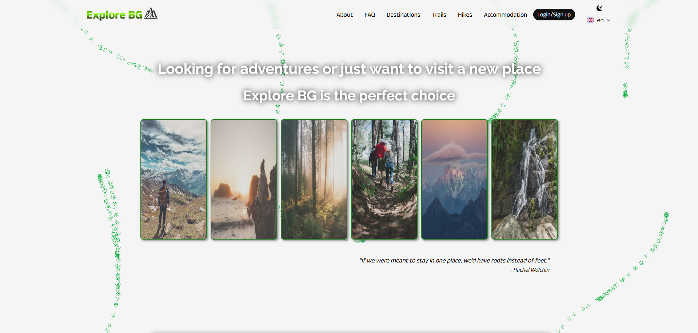

<!-- # Explore BG -->

# 

<br>



You love nature, traveling and discovering new exciting places - Explore BG will guide you on  your journey into the unknown.

## Tech Stack

  

More about the back-end of this app can be found [here](https://github.com/ExploreBG/ExploreBG--API).

## Demo

<!-- View a demo of this app [here](). 👀 -->
TO DO...

## 🚀 About "Explore BG" web app

The client side of the app is built with Next.js, and it follows the Next.js development concepts. It also uses TypeScript for better development and SCSS for styles and has a responsive design.

TO DO...  -> add more info

The application consists of a public part (accessible without authentication) and a private part (available to registered users).

## ⚡ Features

TO DO...

## Run Locally

<!-- - First run [this server](https://github.com/ExploreBG/ExploreBG--API) -->

- Clone the project

```bash
  git clone https://github.com/ExploreBG/ExploreBG
```

- Install dependencies

```bash
  npm i
```

- Start the application with

```bash
  npm run dev
```

## Author

- [@IVo](https://github.com/Ivaylo-St-Ivanov) 👋

## 🔗 Links

[](https://www.linkedin.com/in/ivaylo-st-ivanov)
[](https://ivaylo-ivanov-org.github.io)

## Feedback

If you have any feedback, please reach out to me at ivailo.st.ivanov@gmail.com

## License

[](https://choosealicense.com/licenses/mit/)